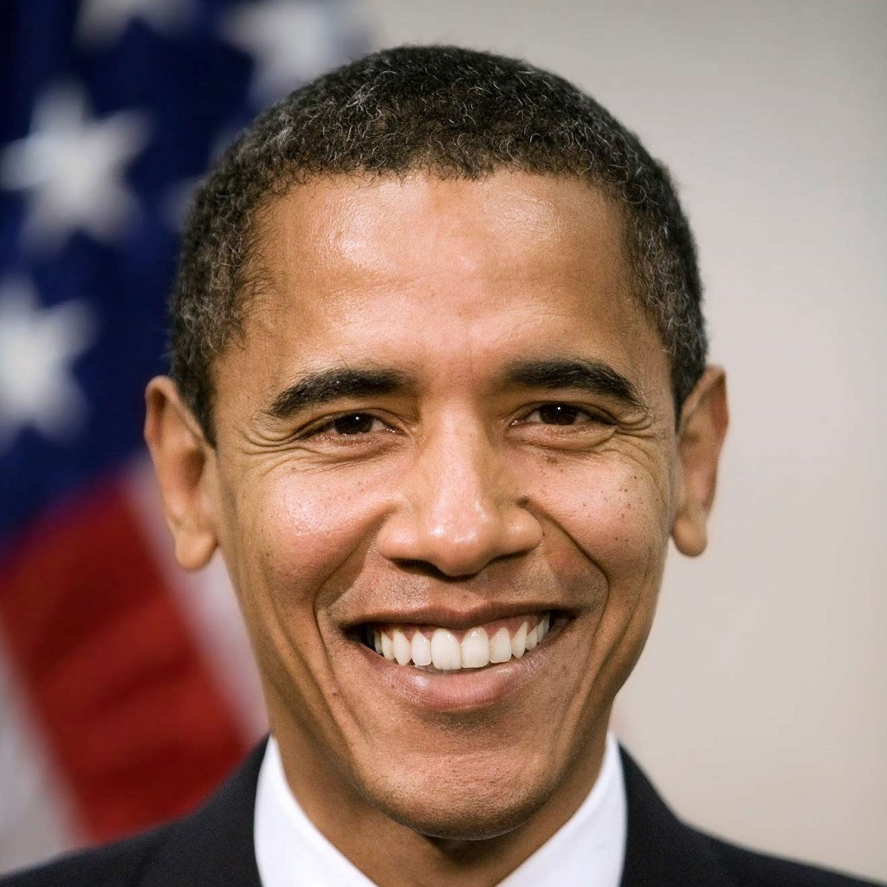
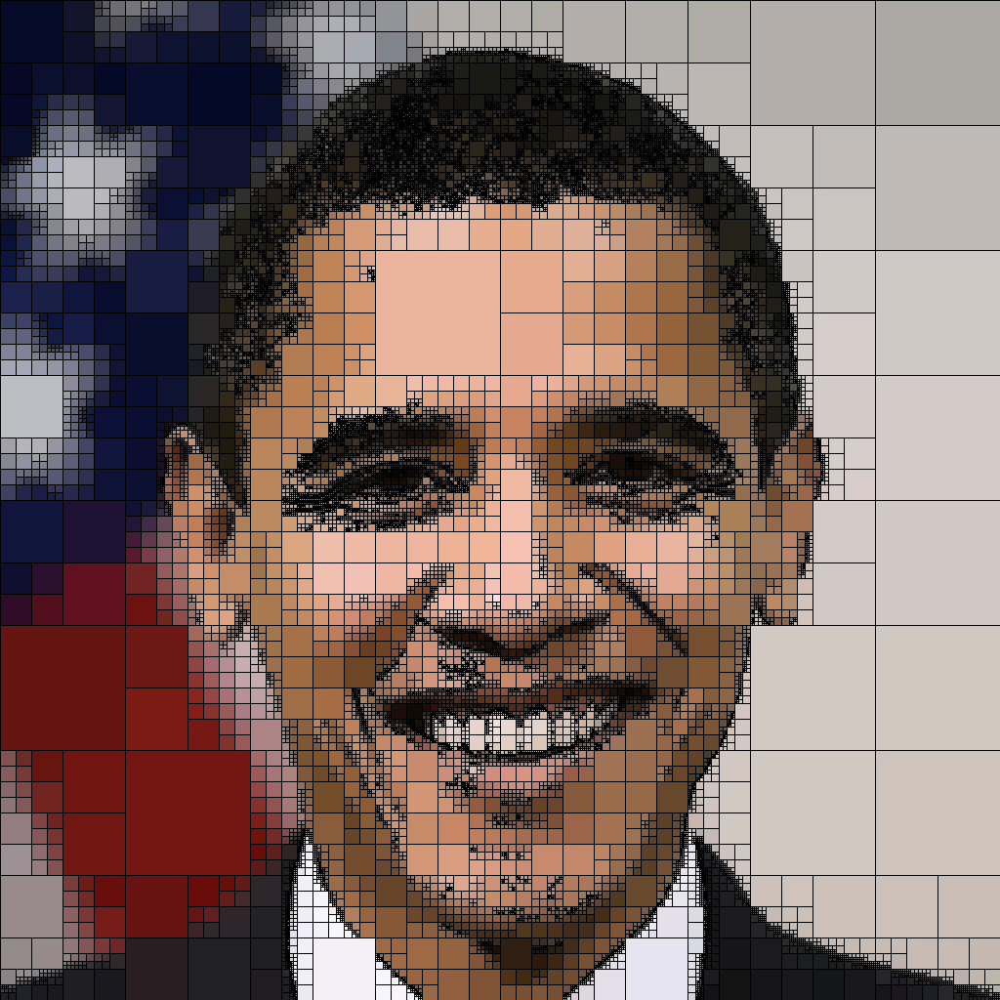
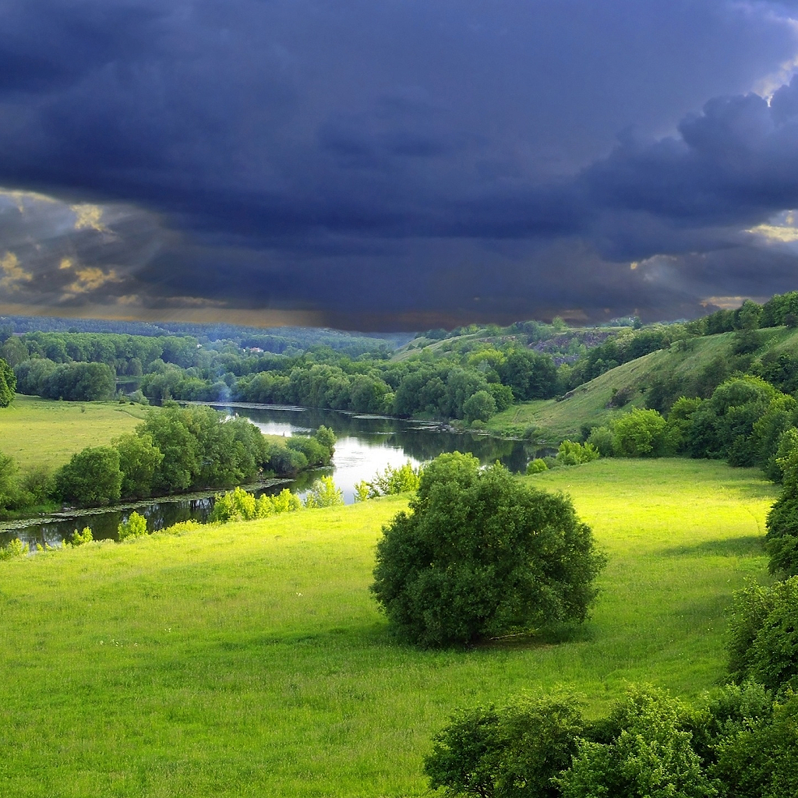
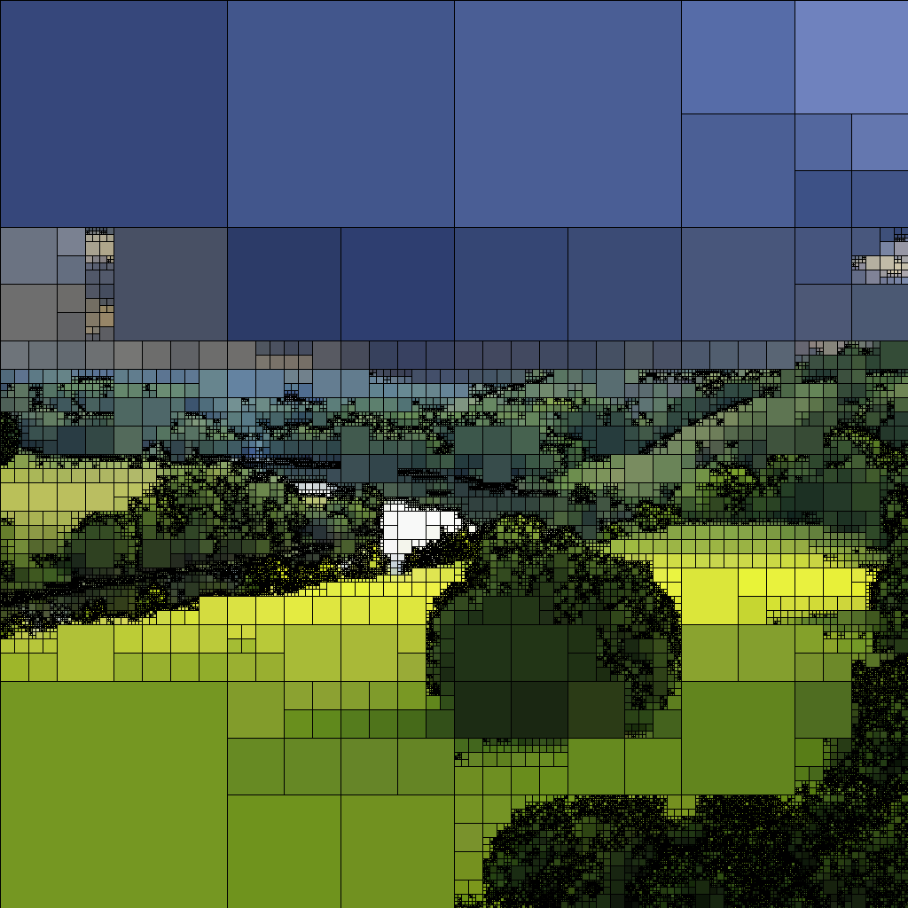
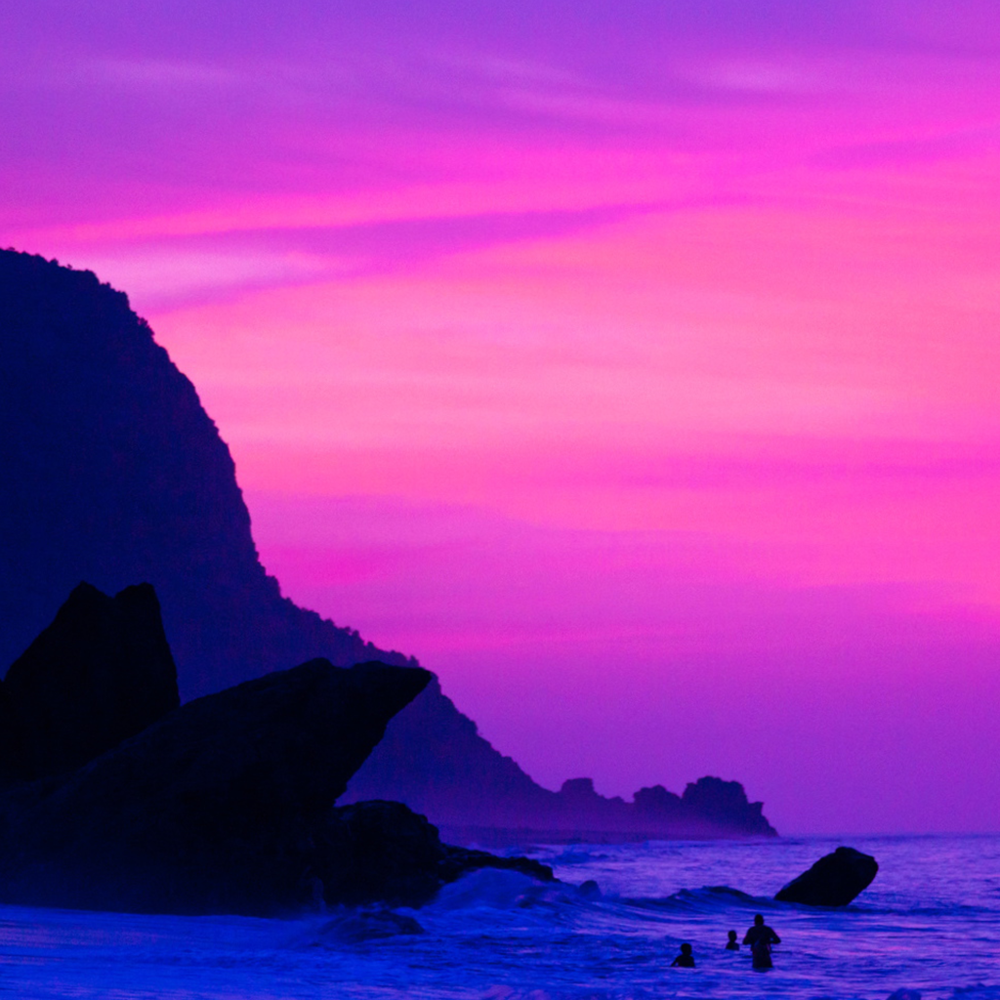
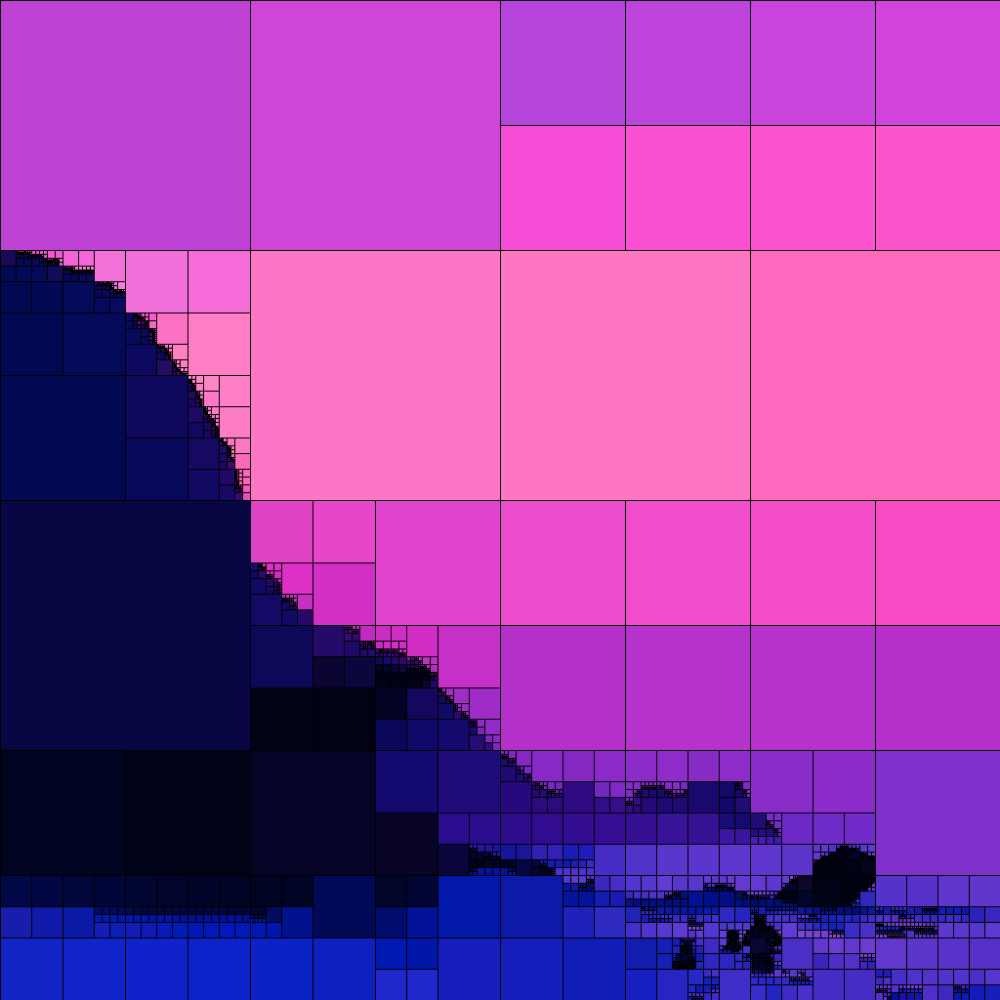

# quad
Generates interesting pictures by using a bastardized implementation of a quadtree to group colors into squares based on how far away their average color is from their region.

# usage
1. Install Go https://golang.org/dl/
2. Install quad `go get github.com/masonelmore/quad`
3. Run quad `# $GOROOT\bin\quad <filename>.png tolerance`

### notes and limitations
* PNG is currently the only supported filetype.
* Tolerance is a float between 0 and 1.  Lower values produce more detailed images.

# examples
|original|quadified|tolerance|
|-|-|-|
|||0.045|
|||0.06|
|||0.06|
